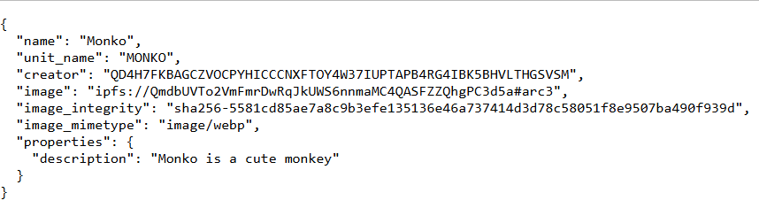
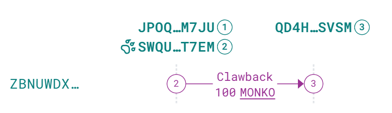

# Task 2: Add Metadata & Asset Controls

🎨 *Make your token meaningful and manageable with ARC-3 metadata and asset controls*

## 📋 Overview

This task demonstrates how to create an Algorand Standard Asset (ASA) with rich metadata using ARC-3 standards and implement asset control features like freeze and clawback functionality.

## 🎯 Task Requirements

- ✅ Attach metadata using **ARC-3**
  - IPFS image upload
  - Description and properties
  - Proper mimetype handling
- ✅ Configure asset roles
  - Manager, Reserve, Freeze, Clawback addresses
- ✅ Demonstrate role actions
  - Clawback operation performed

## 🛠️ Implementation Details

### Asset Configuration
```typescript
const name = "Monko";
const unitName = "MONKO";
const total = 1000;
const decimals = 4;
```

### ARC-3 Metadata Structure
```typescript
const metadata = {
  name: name,
  unit_name: unitName,
  creator: creator.addr.toString(),
  image: `ipfs://${imageCid.IpfsHash}#arc3`,
  image_integrity: `sha256-${imageHash}`,
  image_mimetype: mimeType,
  properties: {
    description: "Monko is a cute monkey"
  }
};
```

### Asset Role Configuration
- **Manager**: Creator account (asset management)  
- **Reserve**: Creator account (token reserves)
- **Freeze**: Account 3 (freeze/unfreeze tokens)
- **Clawback**: Account 4 (clawback tokens)

## 📁 File Structure

```
task-2/
├── main.ts          # Main implementation
├── monko.webp       # Asset image file
└── README.md        # This documentation
```

## 🚀 Setup & Prerequisites

### Dependencies
Make sure you have installed the dependencies:
```bash
npm install
```

### Environment Configuration
Ensure your `.env` file contains:
```env
MNEMONIC=creator_account_mnemonic
MNEMONIC2=receiver_account_mnemonic  
MNEMONIC3=freeze_authority_mnemonic
MNEMONIC4=clawback_authority_mnemonic
NETWORK=testnet
PINATA_TOKEN=your_pinata_api_token
```

## ▶️ Running the Code

Execute the task:
```bash
npm run task-2
```

## 📊 Sample Output

```
NFT minted with ID: 741189716
Receiver opted in to asset 741189716 with txID: DRXUAAE3SP4RHXOUWSNP3YYNDO6PYGNWSNKJ3Z4HEGC45D47BEFA
Asset balance: 0
Asset [100 MONKO] sent to receiver: OGDMMU75X6CQF52JINRORT3WR4ZM3OH6KHIIDN6D6HTVQHML4DMQ
Asset balance for receiver after transfer: 100
Clawbacked 100 MONKO from receiver to creator: ZBNUWDX762ZVSQIB6RXS42SZBUY3WGVOVWOA6POSQP3NMHCRXNNQ
Asset balance for receiver after clawback: 0
```

## 🔗 Explorer Links

### Asset Information
- **Asset ID**: `741189716`
- **Explorer Link**: `https://lora.algokit.io/testnet/asset/741189716`

### Transaction Links
- **Asset Creation**: View on [Lora Explorer](https://lora.algokit.io/testnet/tx/[CREATION_TX_ID])
- **Opt-in Transaction**: [DRXUAAE3SP4RHXOUWSNP3YYNDO6PYGNWSNKJ3Z4HEGC45D47BEFA](https://lora.algokit.io/testnet/tx/DRXUAAE3SP4RHXOUWSNP3YYNDO6PYGNWSNKJ3Z4HEGC45D47BEFA)
- **Transfer Transaction**: [OGDMMU75X6CQF52JINRORT3WR4ZM3OH6KHIIDN6D6HTVQHML4DMQ](https://lora.algokit.io/testnet/tx/OGDMMU75X6CQF52JINRORT3WR4ZM3OH6KHIIDN6D6HTVQHML4DMQ)
- **Clawback Transaction**: [ZBNUWDX762ZVSQIB6RXS42SZBUY3WGVOVWOA6POSQP3NMHCRXNNQ](https://lora.algokit.io/testnet/tx/ZBNUWDX762ZVSQIB6RXS42SZBUY3WGVOVWOA6POSQP3NMHCRXNNQ)

## 📸 Screenshots

### Asset with Metadata


### Clawback Operation


## 🔍 Key Operations

### 1. Image & Metadata Upload
- Uploads `monko.webp` to IPFS via Pinata
- Calculates SHA256 hash for integrity
- Creates ARC-3 compliant metadata JSON
- Uploads metadata to IPFS

### 2. Asset Creation with Controls
```typescript
const nftMint = await algorandClient.send.assetCreate({
  // ... asset parameters
  manager: creator.addr.toString(),
  reserve: creator.addr.toString(), 
  freeze: freezeAuthAddr,
  clawback: clawbackAuthAddr,
});
```

### 3. Clawback Demonstration
```typescript
const clawbackTx = await algorandClient.send.assetTransfer({
  sender: clawback.addr,
  clawbackTarget: receiver.addr,
  assetId: nftMint.assetId,
  amount: BigInt(100 * 10 ** decimals),
  receiver: creator.addr,
  signer: clawback.signer,
});
```

## ✅ Success Criteria

- [x] **ARC-3 Metadata**: Image and metadata successfully uploaded to IPFS
- [x] **Asset Roles**: All roles (Manager, Reserve, Freeze, Clawback) properly configured
- [x] **Role Action**: Clawback operation successfully demonstrated
- [x] **Asset Visibility**: Metadata visible on blockchain explorer
- [x] **Transaction Proof**: All operations recorded with valid transaction IDs

## 📝 Notes

- Uses ARC-3 standard for metadata compliance
- Image integrity verified with SHA256 hash
- IPFS URLs follow `ipfs://[hash]#arc3` format
- Clawback authority can retrieve tokens from any holder
- Asset balance tracking implemented for verification