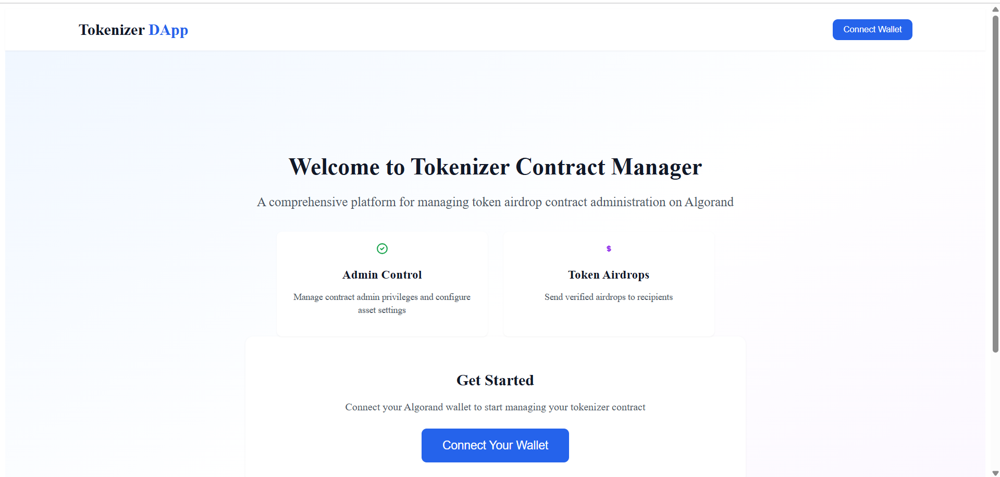
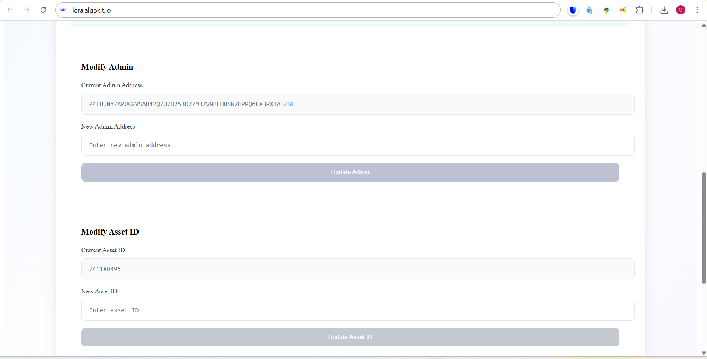
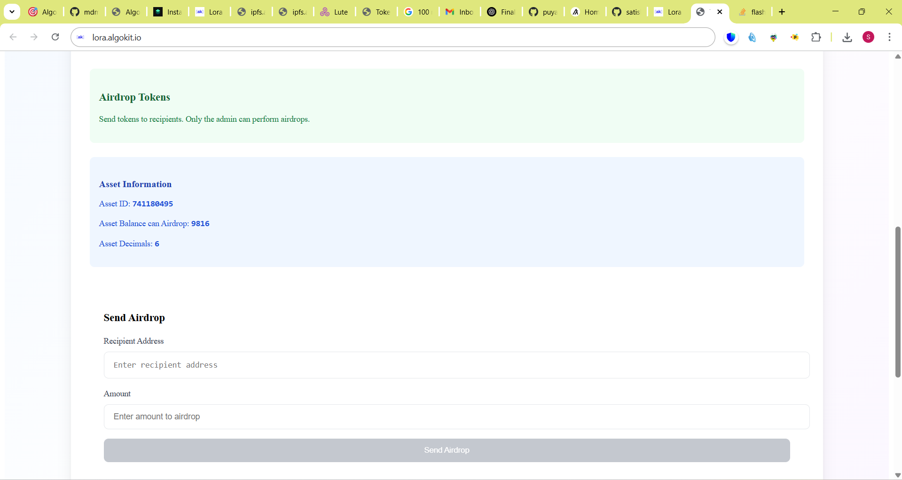

# Task 5: Application Integration

💡 *Embed your ASA or contract into a real app*

## 📋 Overview

This task demonstrates how to build a full-stack decentralized application (DApp) that integrates with Algorand smart contracts and ASAs. The implementation features a React-based frontend that connects to the TokenizerContract from Task 3, providing a complete user interface for contract administration, token airdrops, and asset management.

## 🎯 Task Requirements

- ✅ Build a simple application for ASA/contract interaction
  - Admin panel for contract configuration
  - Airdrop functionality for token distribution
  - User interface for asset opt-in operations
- ✅ Wallet Connection with Algorand Wallets
  - Support for multiple wallet providers
  - Seamless wallet integration
- ✅ Real-life token logic implementation
  - Verified airdrop system
  - Admin access control
  - Asset management interface

## 🛠️ Technology Stack

### Frontend Framework
- **React 18** with TypeScript
- **Vite** for fast development and building
- **Tailwind CSS** for modern, responsive styling

### Algorand Integration
- **@algorandfoundation/algokit-utils** for blockchain operations
- **@txnlab/use-wallet-react** for wallet connectivity
- **AlgoSDK** for low-level blockchain interactions

### Supported Wallets
- **Pera Wallet** (`@perawallet/connect`)
- **Defly Wallet** (`@blockshake/defly-connect`)
- **Lute Connect** (`lute-connect`)

## 🏗️ Application Features

### 🔐 Admin Panel
- Contract configuration management
- Asset ID setup and modification
- Admin privilege controls
- Real-time contract status monitoring

### 🎁 Airdrop System
- Batch token distribution
- Recipient verification
- Transaction history tracking
- Amount validation and limits

### 👤 User Interface
- Asset opt-in functionality
- Balance checking
- Transaction status updates
- Responsive design for all devices

### 🔗 Wallet Integration
- Multi-wallet support
- Account connection status
- Address display and management
- Secure transaction signing

## 📁 Project Structure

```
task-5/
├── projects/task-5/                 # Main React application
│   ├── src/
│   │   ├── components/
│   │   │   ├── AdminPanel.tsx       # Contract admin interface
│   │   │   ├── AirdropSection.tsx   # Token airdrop functionality
│   │   │   ├── TokenizerApp.tsx     # Main app component
│   │   │   ├── AirdropHistory.tsx   # Transaction history
│   │   │   ├── ConnectWallet.tsx    # Wallet connection modal
│   │   │   └── Account.tsx          # Account display
│   │   ├── contracts/               # Generated contract clients
│   │   ├── interfaces/              # TypeScript interfaces
│   │   ├── utils/                   # Utility functions
│   │   ├── styles/                  # CSS styles
│   │   ├── Home.tsx                 # Main page component
│   │   └── App.tsx                  # Root component
│   ├── public/                      # Static assets
│   ├── package.json                 # Dependencies and scripts
│   └── vite.config.ts              # Vite configuration
├── .algokit.toml                   # AlgoKit configuration
└── README.md                       # This documentation
```

## 🚀 Setup & Installation

### Prerequisites
- Node.js >= 20.0
- npm >= 9.0
- AlgoKit CLI

### Installation Steps

1. **Clone and Navigate**
   ```bash
   cd task-5/projects/task-5
   ```

2. **Install Dependencies**
   ```bash
   npm install
   ```

3. **Generate Contract Clients**
   ```bash
   npm run generate:app-clients
   ```

4. **Start Development Server**
   ```bash
   npm run dev
   ```

## ▶️ Running the Application

### Development Mode
Execute from the root directory:
```bash
npm run task-5
```

Or directly from the project directory:
```bash
cd task-5/projects/task-5
npm run dev
```

### Production Build
```bash
cd task-5/projects/task-5
npm run build
npm run preview
```

## 📱 Application Walkthrough

### 1. **Welcome Screen**
- Clean, professional landing page
- Feature overview with visual icons
- Clear call-to-action for wallet connection
- Responsive design for all screen sizes

### 2. **Wallet Connection**
- Multi-wallet provider support
- Secure connection flow
- Real-time connection status
- Address truncation for privacy

### 3. **Admin Dashboard**
- Contract configuration panel
- Asset management interface
- Admin privilege controls
- Status monitoring widgets

### 4. **Airdrop Operations**
- Recipient address input
- Token amount specification
- Batch processing capabilities
- Transaction confirmation

### 5. **User Features**
- Asset opt-in functionality
- Balance checking
- Transaction history
- Status notifications

## 🔗 Integration with Task 3 Contract

### Contract Connection
```typescript
// Connects to TokenizerContract from Task 3
const tokenizerContract = new TokenizerContractFactory({
  algorand: algorandClient,
  defaultSender: activeAddress,
  defaultSigner: transactionSigner,
});
```

### Key Integrations
- **Verified Airdrop**: Interface for contract's `verifiedAirdrop` method
- **Admin Management**: UI for `modifyAdmin` functionality
- **Asset Configuration**: Interface for `modifyAsa` operations
- **Real-time Updates**: Live contract state monitoring

## ✅ Success Criteria

- [x] **App Interface**: Complete React frontend with modern UI/UX
- [x] **Contract Integration**: Seamless connection to TokenizerContract
- [x] **Wallet Connection**: Multi-provider wallet support implemented
- [x] **Real-life Logic**: Token airdrop and asset management functionality
- [x] **User Experience**: Intuitive interface for both admins and users
- [x] **Responsive Design**: Works across desktop and mobile devices

## 📸 Screenshots

### Application Dashboard


### Admin Contract Configuration


### Airdrop Interface


## 🌐 Live Demo
[](https://youtu.be/o8VIUp4Uvuc)

### Local Development
The application runs locally at `http://localhost:5173` when using the development server.

### Video Walkthrough
*[Link to video demonstration showing wallet connection, contract interaction, and airdrop functionality]*

## 📝 Features Demonstrated

### Admin Functionality
- Contract deployment and configuration
- Asset ID management within contract
- Admin privilege transfer
- Airdrop execution and monitoring

### User Experience
- Wallet connection with multiple providers
- Asset opt-in process
- Real-time balance updates
- Transaction status tracking

### Technical Implementation
- TypeScript for type safety
- React hooks for state management
- Error boundaries for robust error handling
- Responsive design with Tailwind CSS

## 🔗 Related Files

- `../task-3/` - TokenizerContract implementation
- `../config.ts` - Algorand client configuration
- `../utils.ts` - Utility functions

## 💡 Real-world Applications

### Use Cases Demonstrated
- **Token Distribution Platforms**: Automated airdrop systems
- **DeFi Applications**: Asset management interfaces
- **DAO Governance**: Admin control panels
- **NFT Marketplaces**: Asset opt-in workflows

### Technical Patterns
- Smart contract client generation
- Multi-wallet integration patterns
- React component architecture
- TypeScript interface design

---

